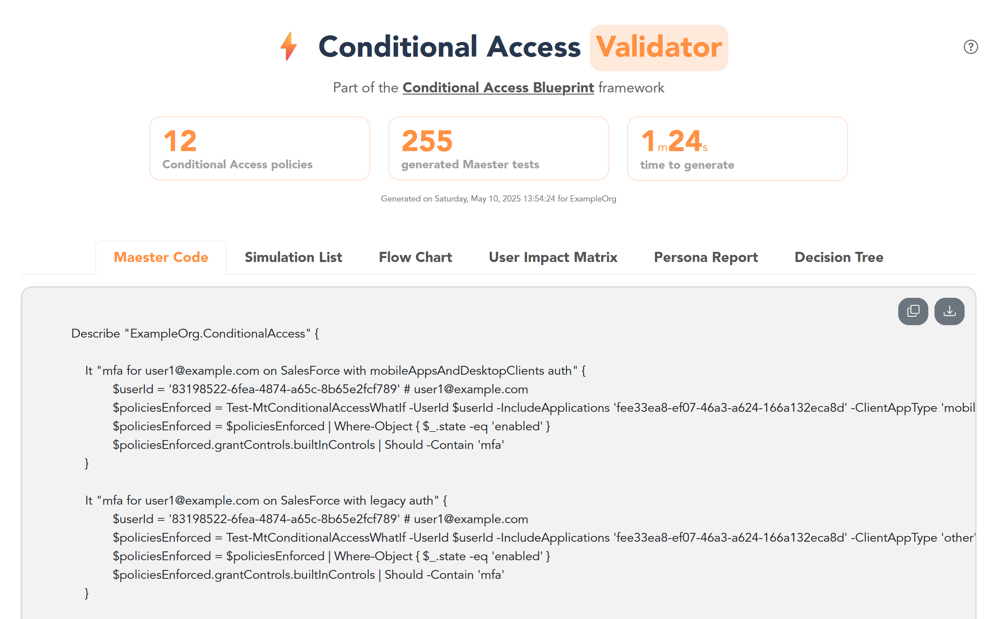

<br>
<p align="center">
  <a href="https://jbaes.be/CAB">
    
  </a>
  <h3 align="center">Conditional Access Validator <small>(preview)</small></h3>
  <p align="center"> 
    By <a href="https://www.linkedin.com/in/jasper-baes">Jasper Baes</a>
    <br />
    <a href="https://github.com/jasperbaes/Conditional-Access-Validator#%EF%B8%8F-installation">Installation</a>
    ·
     <a href="https://github.com/jasperbaes/Conditional-Access-Validator#-usage">Usage</a>
    ·
    <a href="https://github.com/jasperbaes/Conditional-Access-Validator/issues">Report Bug</a>
  </p>
</p>

<p align="center">The Conditional Access Validator is part the CA framework: the <a href="https://www.jbaes.be/CAB">Conditional Access Blueprint</a></p>

# 🚀 About

The Conditional Access Validator is a PowerShell tool that automatically generates a HTML report with:
- <a href="https://maester.dev">Maester.dev</a> test for Conditional access
- a flow chart of Conditional Access
- the Conditional Access Matrix (a CSV with the included/excluded state per user per CA policy)
- Conditional Access Persona Report




<a href="https://www.jbaes.be/CAF/Conditional-Access-Validator-example.html">Open example report</a>

# 🛠️ Installation

```powershell
git clone https://github.com/jasperbaes/Conditional-Access-Validator
cd Conditional-Access-Validator
Install-Module Microsoft.Graph
```

Authenticating can be done with the `Connect-MgGraph` command ('Policy.Read.All', 'Directory.Read.All', 'Application.Read.All') or with an App Registration. To use an App Registration, create the file `settings.json` in the root of the project and set the credentials in following JSON object:

```json
{
    "tenantID": "",
    "clientID": "",
    "clientSecret": ""
}
```

[](https://www.youtube.com/watch?v=AkW3UMU6v3Q&t=173)

# 💻 Usage

```powershell
# Connecting with your user account
Connect-MgGraph
.\run.ps1

# Connecting with an App Registration
.\run.ps1

# OR if you want to include CA policies that are in 'report-only' mode
Connect-MgGraph
.\run.ps1 -IncludeReportOnly

# OR if you want to skip the User Impact Matrix
Connect-MgGraph
.\run.ps1 -SkipUserImpactMatrix

# OR if you want to limit the User Impact Matrix to the first 10 users
Connect-MgGraph
.\run.ps1 -UserImpactMatrixLimit 10
```

[](https://www.youtube.com/watch?v=AkW3UMU6v3Q&t=182)

# 💡 Hardcoded rules

For each Conditional Access policy, a test is created based on the configured properties in the CA policy itself.

Some hard-coded rules:
- Conditional Access policies are imported sorted on their name.
- If the CA policy is scoped on `'All users'`, we limit the scope to 5 random users. These accounts are indicated with `'(random)'` after their UPN
- If the CA policy is scoped on a group (included or excluded), we limit the scope to 5 random users of that group. These accounts are indicated with `'(random)'` after their UPN
- If the CA policy is scoped on `'All guests'`, we limit the scope to 2 random guests. These accounts are indicated with `'(random)'` after their UPN
- If the CA policy is scoped on `'All resources'` cloud apps, we limit the scope to `Office 365 Exchange Online`, `Office 365 SharePoint Online` and `Office 365 Portal`
- If the CA policy is scoped on `Office365` cloud apps, we limit the scope to `Office 365 Exchange Online`, `Office 365 SharePoint Online` and `Office 365 Portal`
- If the CA policy is scoped on more than 3 cloud apps, we limit the scope to the first 3 applications
- If the CA policy is scope on a Named Location, we add tests for each IP range of the Named Location
- If the CA policy is scope on a Named Location, the country of the test will always be `'FR'` (France)

# 🚧 Current limitations  
- Insider risk is not supported yet
- User principal risk is not supported yet
- Device properties are not supported yet
- Session controls are not supported yet
- Directory roles are not supported by Maester
- Excluded guest users are not supported, only included guests are supported
- Guest types are not supported by Maester. In each case, 2 random guests are chosen for the test.
- JSON Crack is integrated to visualize the flow chart. JSON Crack has a size limitation in their free plan.

Discovered a bug or do you have an improvement? Create an <a href="https://github.com/jasperbaes/Conditional-Access-Validator/issues">issue</a>.

# 🆕 Release history

Release version numbers: YEAR.WEEK

- 2025.22
  - add button to download CA policies
  - add local caching
  - bug fix ([PowerBugi](https://github.com/jasperbaes/Conditional-Access-Validator/pull/1/files))
- 2025.21
  - initial release (preview)

# 🏁 Roadmap
- Simulations
  - Fix: add a check so random chosen users are not excluded from the CA policy
  - Add Insider risk and User Principal risk
  - Add device properties
  - Add other access controls
  - Add session controls
- Add error handeling
- Add search field and filters to HTML (CA policy, CA state)
- Impact Matrix
  - add user impact changes in past 30 days audit logs
- Persona report
  - Hide groups that are empty
  - Create hierarchy chart of nested groups
- Conditional Access documentations
- Conditional Access hygiene tests  
- Refactor report to API approach
- Advanced Hunting
  - Show applications that can be scoped to an IP range (e.g. https://www.jbaes.be/posts/cloud-apps-ip-allowlisting)
  - ...

Want to contribute? Fork this repository and create a <a href="https://github.com/jasperbaes/Conditional-Access-Validator/pulls">Pull request</a>. The Conditional Access Validator architecture is modular.

# 📜 License

Shield: [![CC BY-NC-SA 4.0][cc-by-nc-sa-shield]][cc-by-nc-sa]

This work is licensed under a
[Creative Commons Attribution-NonCommercial-ShareAlike 4.0 International License][cc-by-nc-sa].

[![CC BY-NC-SA 4.0][cc-by-nc-sa-image]][cc-by-nc-sa]

[cc-by-nc-sa]: http://creativecommons.org/licenses/by-nc-sa/4.0/
[cc-by-nc-sa-image]: https://licensebuttons.net/l/by-nc-sa/4.0/88x31.png
[cc-by-nc-sa-shield]: https://img.shields.io/badge/License-CC%20BY--NC--SA%204.0-lightgrey.svg

Thank you for respecting these usage terms and contributing to a fair and ethical software community. Commercial use is allowed only with my prior written permission. Please contact me via LinkedIn.

Jasper Baes (https://www.linkedin.com/in/jasper-baes)

Buy Me a Coffee (https://buymeacoffee.com/jasperbaes)
